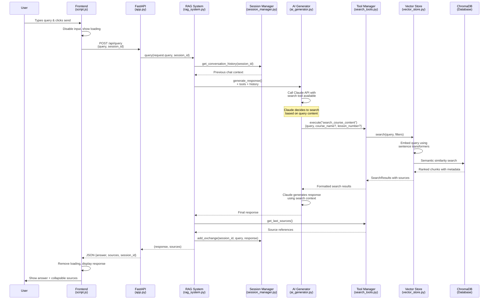
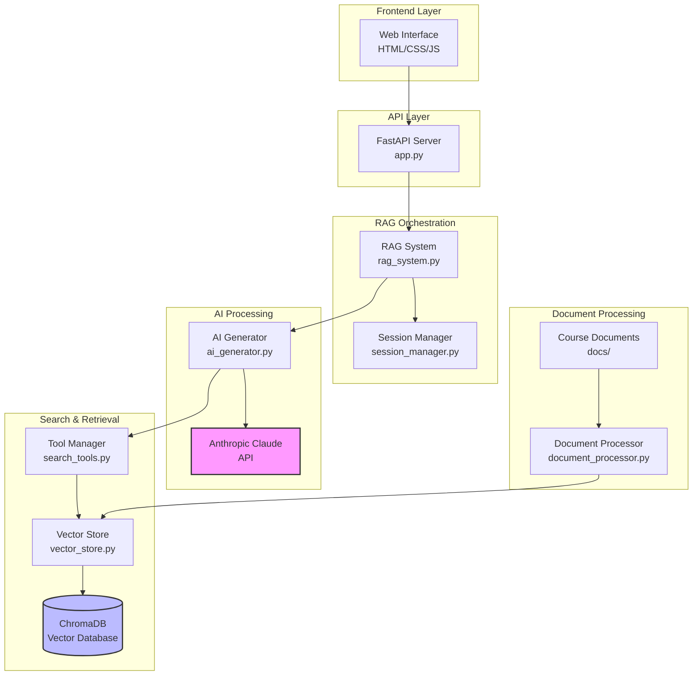
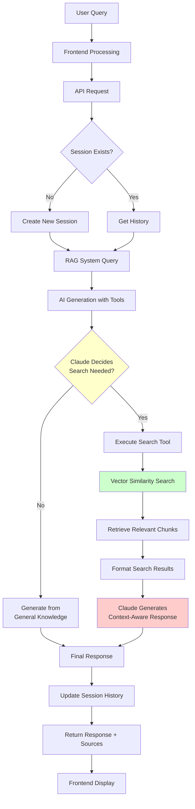

# RAG System Query Processing Flow

## Architecture Components

## Data Flow Detail

## Key Features Illustrated

1. **Session Management**: Maintains conversation context across queries
2. **Tool-Based Search**: Claude intelligently decides when to search
3. **Semantic Retrieval**: Vector similarity matching in ChromaDB
4. **Source Attribution**: Tracks and returns document sources
5. **Async Processing**: Non-blocking frontend with loading states
6. **Error Handling**: Graceful failures at each layer